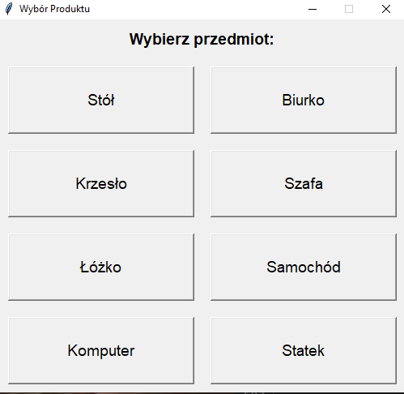
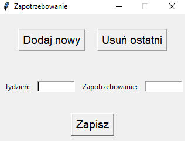
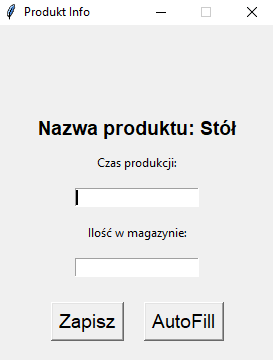
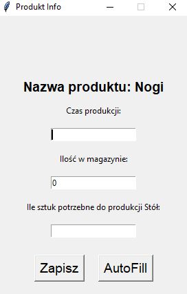
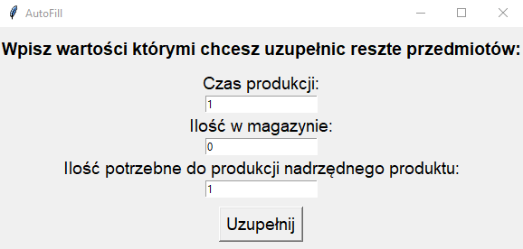

# MRP Calculator

## What is it for?

MRP Calculator is a utility designed to create Excel tables with Components,
necessary to manufacture an End product. The program comes with pre-defined BOM templates up to level 3.

## Crossroads

If you consider yourself the first one, don't be scared to launch "mrp.exe".
We tried our best to make the user experience as clear and comfortable as it
could be (anyway we're still open to suggestions!). 

But if you feel like you're the second type of person, this README will gladly
take your hand and guide you all the way to the finish and help with executing
our creation as it is supposed to.

## Installation

To succesfully use the program, run the following instruction in your virtual
environment:

"pip install -r requirements.txt"

## Working with MRP Calculator

### 1. Choosing your item
After the installation, run "main.py" or mrp.exe
You will be granted with an ability to choose one of the presets of items supported by
the program: 

  

Level 2s:
- Table (Stół), Desk (Biurko), Chair (Krzesło), Wardrobe (Szafa), Bed (Łóżko) 
Level 3s:
- Car (Samochód), Computer (Komputer), Ship (Statek)

### 2. Setting demands
After choosing your desired product you'll have the option to set the demands of your chosen item:

  

Here the button [Dodaj nowy] allows you to add a new demand, and [Usuń ostatni] lets you delete the latest one

### 3. Setting product info
Shortly after you will face a new window with inputs such as: production time(czas produkcji), stock(ilość w magazynie) and the quantity needed for the parent product(Ile sztuk potrzebne do produkcji)

  
  

Consider also using an Autofill button, which will fill all of the remaining products with values provided by the user:

  

### 4. Getting results

After providing everything, if the production is possible, the program is going to generate and open an excel file containing the generated MRP tables from data provided by the user. 

